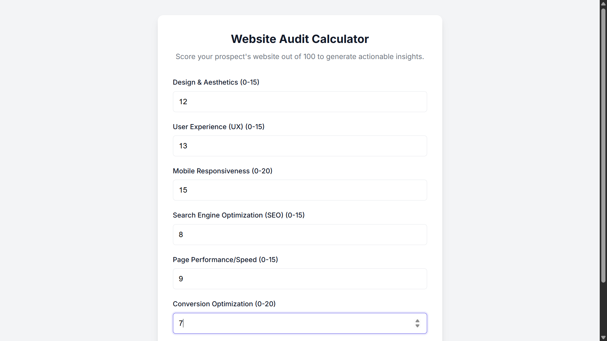
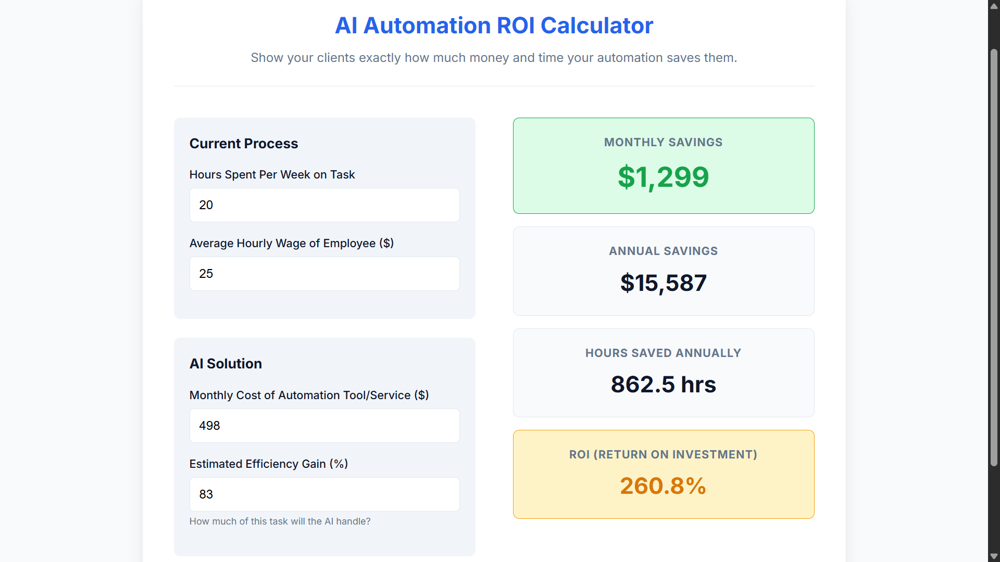
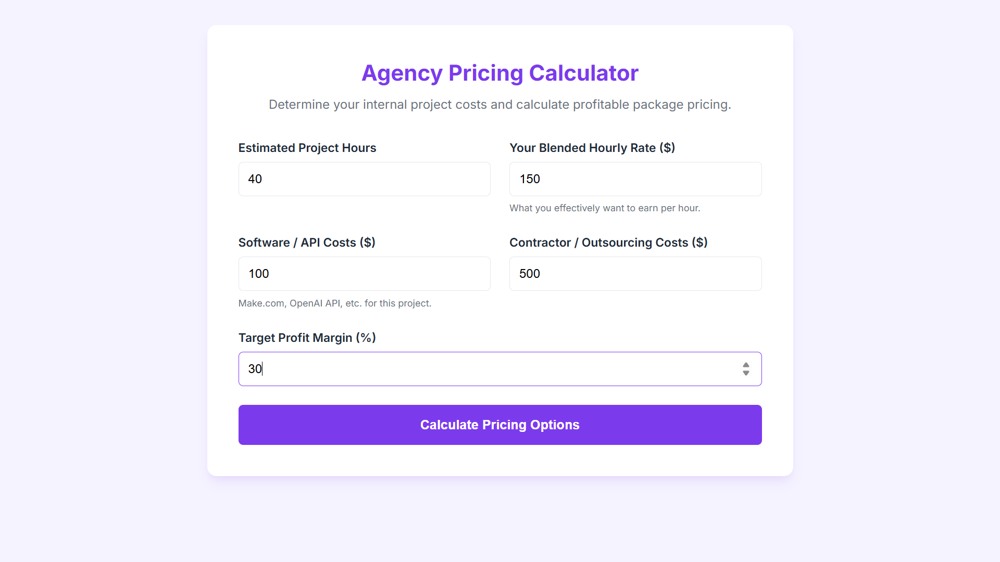
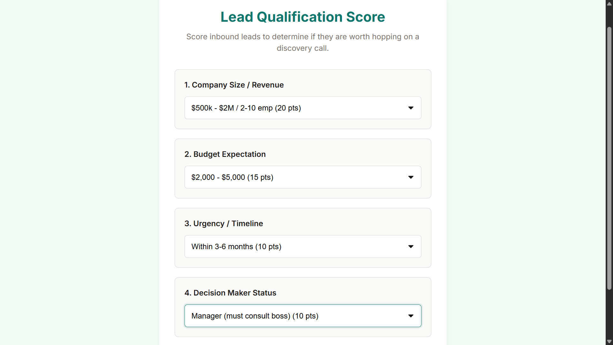

<div align="center">
  

  <h1>AI Agency Starter Kit 🚀</h1>
  
  <p><strong>The definitive open-source toolkit for AI automation agencies, freelancers, and consultants.</strong></p>

  <p>
    <a href="https://opensource.org/licenses/MIT"></a>
    <a href="https://github.com/rdxcodex/AI-Agency-Starter-Kit/stargazers"></a>
    <a href="http://makeapullrequest.com"></a>
    <a href="https://github.com/ellerbrock/open-source-badges/"></a>
  </p>
</div>

---

## ⚡ Why This Project Exists

The AI automation space is exploding, yet most newcomers waste hundreds of hours figuring out business fundamentals: pricing, proposals, sales scripts, and ROI calculators. 

We built the **AI Agency Starter Kit** to eliminate this administrative overhead. It moves beyond generic advice and provides the exact documents, templates, frameworks, and interactive web tools you need to close deals and deliver value. Our goal? To **standardize quality** and **accelerate time-to-market** for AI builders worldwide.

---
## Interactive Tools Preview

| Website Audit | ROI Calculator |
|--------------|---------------|
|  |  |

| Pricing Calculator | Lead Qualification |
|-------------------|-------------------|
|  |  |

## ✨ Features & Architecture

This repository is designed as a modular, comprehensive operating system for your agency.

### 🛠️ Interactive Web Tools
Self-contained, dependency-free HTML/CSS/JS applications ready to be embedded on your site for lead generation or used internally.
- **[Website Audit Score Calculator](./tools/website-audit-score-calculator)** - Grade prospects & generate leads.
- **[AI Automation ROI Calculator](./tools/ai-automation-roi-calculator)** - Quantify the financial impact of your AI solutions.
- **[Agency Pricing Calculator](./tools/agency-pricing-calculator)** - Optimize your margins and package pricing.
- **[Lead Qualification Calculator](./tools/lead-qualification-calculator)** - Objectively score inbound leads.

### 🤝 Client Acquisition & Sales
Everything you need to find, pitch, and close high-ticket clients.
- **Outreach:** Cold email, LinkedIn, Instagram, and DM scripts (`/sales-scripts`).
- **Discovery:** BANT qualification, discovery frameworks, and objection handling (`/discovery-calls`).
- **Closing:** High-converting B2B proposals and professional legal contracts (`/proposals`, `/contracts`).

### 🤖 AI Solutions & Prompts
Production-ready system prompts and logic frameworks for building agents.
- **Chatbot Prompts (`/chatbot-prompts`):** 20+ specialized prompts for real estate, e-commerce, restaurants, gyms, and dental clinics.
- **Voice AI (`/voice-agent-prompts`):** 20+ prompts for AI receptionists, triage, lead qualification, and appointment booking.
- **Workflows (`/restaurant-automation`):** Make.com/Zapier logic blueprints for reservation booking and SMS reactivation.

### 💼 Business Operations
Templates to run the agency efficiently.
- **Pricing:** 3-tier value-based pricing frameworks (`/pricing-frameworks`).
- **Delivery:** Project handoff checklists and client SOP training templates (`/client-delivery`).
- **Proof:** Fill-in-the-blank case study templates (`/case-study-templates`).

---

## 🚀 Quick Start Guide

Get your agency up and running in minutes.

### Prerequisites
* Git installed on your local machine.
* A code editor (like VS Code) or any markdown viewer.
* A basic web browser to view the interactive tools.

### Installation

1. **Clone the repository:**
   ```bash
   git clone https://github.com/rdxcodex/AI-Agency-Starter-Kit.git
   cd AI-Agency-Starter-Kit
   ```

2. **Test the Tools:**
   Navigate to the `/tools` directory. Open any `index.html` file directly in your browser (no build step required!):
   ```bash
   # Example for MacOS/Linux
   open tools/ai-automation-roi-calculator/index.html
   ```
   *(On Windows, just double-click the `index.html` file)*

3. **Customize the Templates:**
   Open the repository in your editor. Search for `[Bracketed Text]` globally across the `.md` files to find variables you need to replace with your agency's name, pricing, and links.

---

## 🎯 Target Audience

Whether you are just starting or scaling to 7 figures, this kit is for:
- 🏢 **AI Automation Agencies (AAA)** standardizing their operations.
- 👨‍💻 **Freelance Developers & Voice Agent Builders** needing professional business collateral.
- 🌐 **Web Development Agencies** looking to upsell AI and automation services.
- 💼 **Technology Consultants** running structured AI discovery sessions.

---

## 🗺️ Roadmap Highlights

We are constantly expanding the kit. Here's a glimpse of what's coming:
- [ ] Comprehensive Make.com Blueprint JSON exports.
- [ ] Vapi and Retell AI custom integration templates.
- [ ] Legal compliance checklists (GDPR/CCPA/HIPAA for AI).
- [ ] Notion/Figma versions of the templates.

*See the full [ROADMAP.md](./ROADMAP.md) for more details.*

---

## 🤝 Contributing

This is a community-driven project! We want your best prompts, scripts, and tools. 

**How to contribute:**
1. Fork the Project
2. Create your Feature Branch (`git checkout -b feature/AmazingFeature`)
3. Commit your Changes (`git commit -m 'Add some AmazingFeature'`)
4. Push to the Branch (`git push origin feature/AmazingFeature`)
5. Open a Pull Request

Please review our [CONTRIBUTING.md](./CONTRIBUTING.md) for full guidelines.

---

## 📄 License

Distributed under the MIT License. See [LICENSE](LICENSE) for more information.

<div align="center">
  <i>Built with ❤️ for the open-source AI community.</i>
</div>
